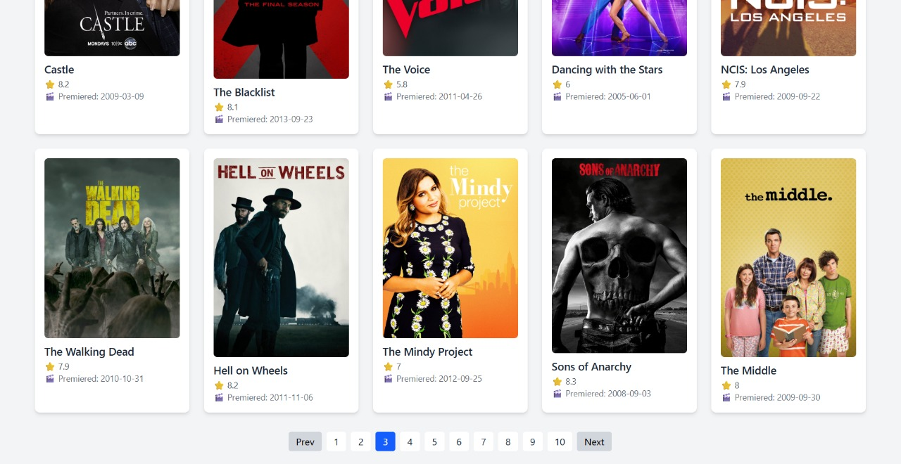

# 🎬 Movies Listing App

A fast, structured, and scalable React app that lists TV shows using the [TVMaze API](https://api.tvmaze.com/shows). Built with **Vite**, **Redux Toolkit**, and **TailwindCSS** — because speed, clarity, and control matter.

## ⚡ Why I Built This

To sharpen my frontend architecture skills — not with tutorials, but by solving real API integration, state management, and performance trade-offs. This isn’t a toy project — it’s practice for production thinking.

## 🧠 Tech Stack

| Tool          | Purpose                             |
| ------------- | ----------------------------------- |
| React + Vite  | Component-based UI, fast bundling   |
| Redux Toolkit | Predictable and scalable state      |
| TailwindCSS   | Utility-first styling, rapid design |
| TVMaze API    | Real-world data to structure around |

## ✅ Core Features

- 🚀 **Fast initial load** with Vite
- 🧱 **Modular structure** — scalable components and features
- 📦 **Redux-based state flow** — clean data fetching and caching
- 🔄 **Pagination** — controlled 25-item batching from API
- 🧭 **Auto-scroll to top** on navigation for better UX
- 🛠️ Designed for **extensibility** — easy to scale

## 🧭 Setup Instructions

```bash
git clone https://github.com/Shivvardhan/movies-listing.git
cd movies-listing
npm install
npm run dev
```

Visit http://localhost:5173

🔍 Folder Structure
```bash
src/
├── components/ // UI elements (cards, loaders)
├── MovieCard.jsx // Card Component
├── Redux/ // Redux slices
├── store.js // Redux store config
├── moviesSlice.js // Movies Reducer
├── src/ // Page-level containers
├── App.jsx // Root structure
├── index.css // Tailwind import
└── main.jsx // Vite app entry
```

🎯 Future Enhancements
These aren’t “nice to haves.” These are growth steps:

- 🔍 Add search with debounce
- 📄 Create detail pages with nested routing 
- 🌓 Add Dark Mode toggle via context 
- 💬 Integrate user review system with mock backend 
- 🔒 Add auth system for favoriting shows 

## 📷 Screenshots

### 🎬 Homepage View


### 🔄 Pagination in Action



🧠 About the Developer
I’m Shiv Vardhan Singh Sikarwar, a CSE student who builds with purpose and intensity.
My projects aren’t just checkboxes — they’re training grounds for real-world development.
If something can be done better, faster, or smarter, I want to figure it out and do it.

🔗 GitHub: https://github.com/Shivvardhan

🧠 Connect with me on LinkedIn: https://www.linkedin.com/in/shivvardhan/

🧱 License
MIT — because innovation scales when it’s open.
